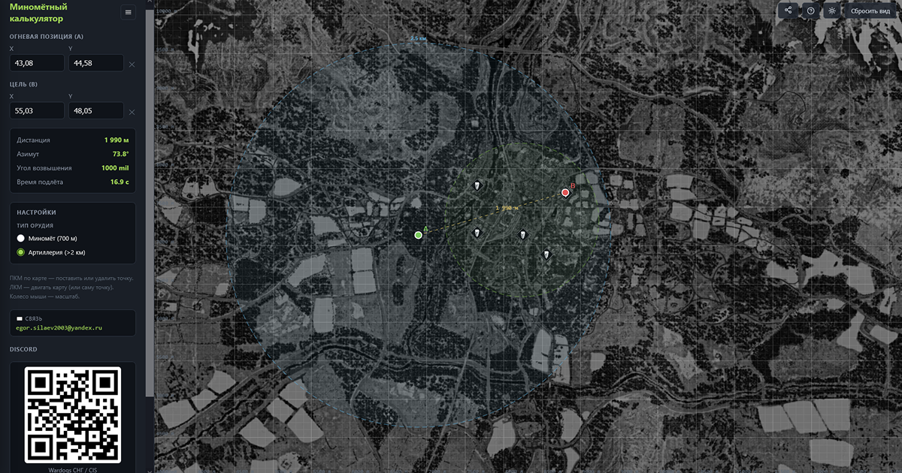
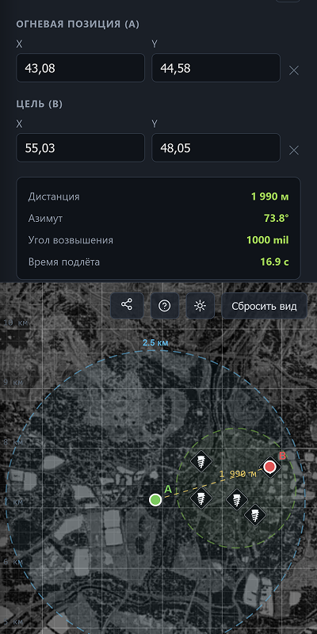

# WARDOGS — Mörser- & Artillerie-Rechner

[Русский](README.md) · [English](README.en.md) · [Deutsch](README.de.md) · [Français](README.fr.md) · [Español](README.es.md) · [Polski](README.pl.md) · [Українська](README.uk.md) · [Türkçe](README.tr.md) · [中文](README.zh.md)

Inoffizieller interaktiver Mörser- und Artillerie-Rechner für den Taktik-Shooter
**WARDOGS**. Distanz, Azimut, Erhöhung (mils) — mit zwei Klicks
auf der 16×16-km-Karte.

**Live-Demo:** https://djzet.github.io/wardogs-calc/

| Desktop | Mobil |
| :-: | :-: |
|  |  |

## Funktionen

- Interaktive Karte mit Kachel-Zoom und Pan
- Distanz, Azimut, Erhöhung (mils)
- Mörser (700 m) und Artillerie (2,5 km)
- Share-Links, Autospeichern, Themes
- 9 Sprachen, mobile Version

Vollständige Liste — in [docs/features.md](docs/features.md).

## Dokumentation (RU)

- [development.md](docs/development.md) — Start & Architektur
- [features.md](docs/features.md) — Funktionen & Waffendaten
- [localization.md](docs/localization.md) — Übersetzungen
- [contributing.md](docs/contributing.md) — Mitwirken

## Kontakt

- egor.silaev2003@yandex.ru
- [Wardogs CIS](https://discord.gg/kwxrTCJxre)
- @djzet

## Lizenz

MIT © Egor Silaev